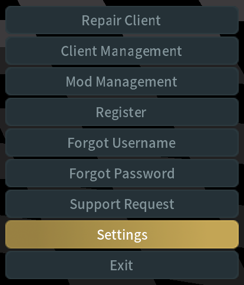
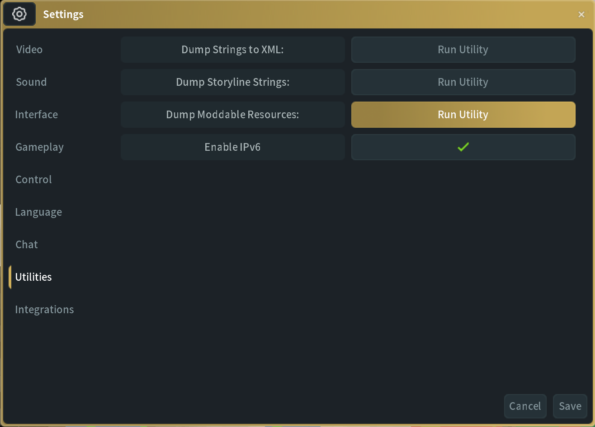
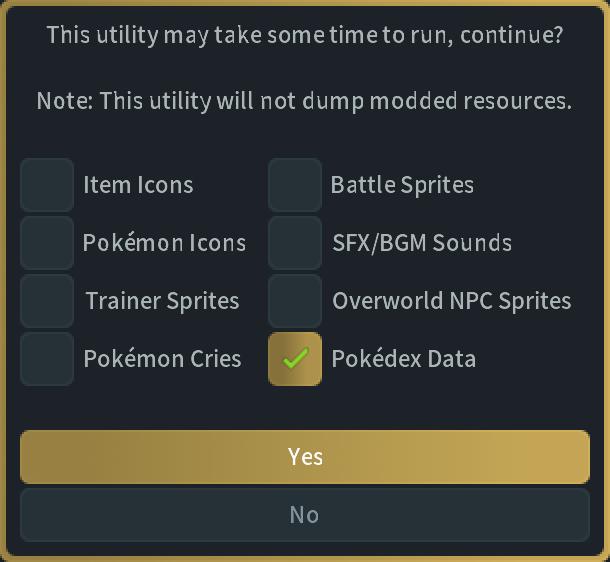
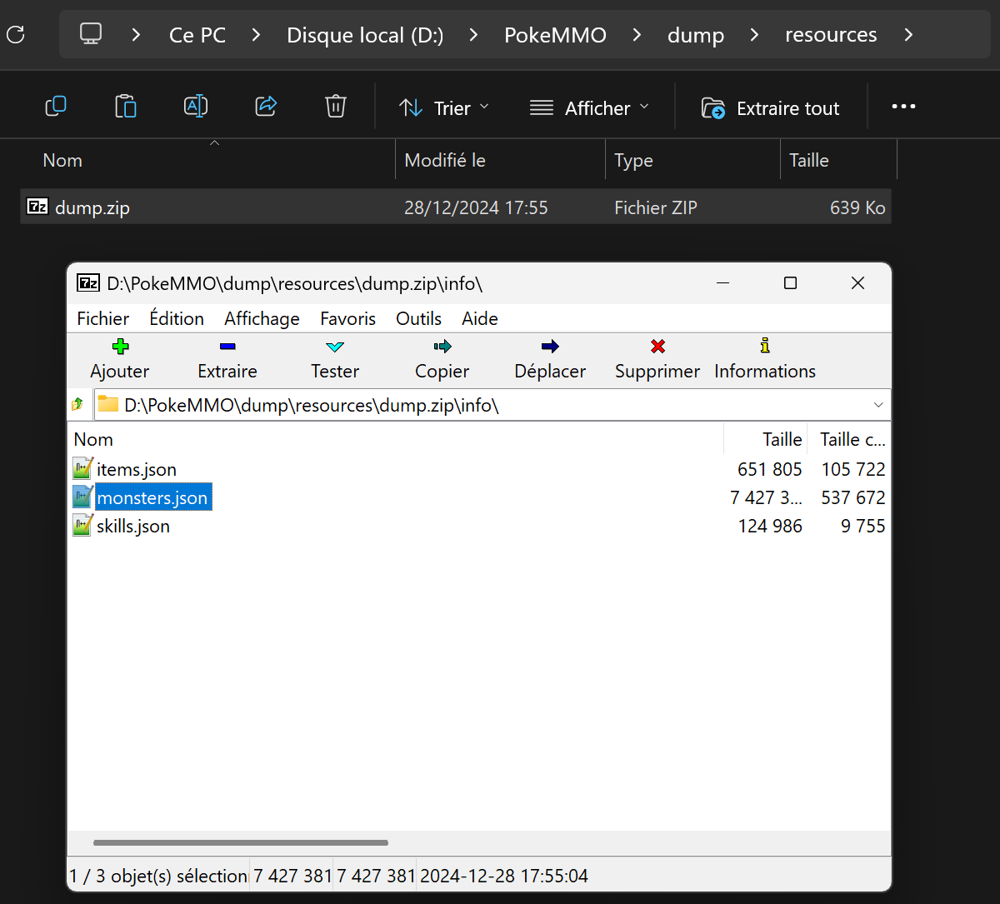

# README

### <a href="https://surfingnet.github.io/PokeMMO-Optimal-Party/" target="_blank">>Live demo<</a>

## Features
- Quick overview of the best monsters, type-wise and stats-wise, at a maximum tier.
- Computation of the best party in the top of the pool.
- Monster bans.
- Cook an egg on your laptop.

## What it does NOT do
- Simulate a combat.
- Take into account cancer tactics, specific skills or items.
- Use your GPU (for now?)

> [!NOTE]
>
> Requires the user to input the monsters data (`monsters.json`)
> which is not provided here.
> It can be dumped out of PokeMMO very easily.
> More on that below.

> [!WARNING]
>
> Will max and heat up your CPU.
> Spreading the workload across a lot of threads increases RAM usage.
> Expect the computation of all the combinations of 6 in 70 monsters (131 115 985 parties) spread across 12 threads to require **14Gb of free RAM**.

## How to use

### Get Monsters Data

1. Go to settings
   

     
See image

     
   

2. Go to utilities, Dump Moddable Resources
   

     
See image

     
   

3. Select Monsterdex Data, click Yes
   

     
See image

     
   

4. Check confirmation popup
   

     
See image

     
   

5. Find the archive in dump/resources
   

     
See image

     
   

6. Extract the archive with your favorite file archiver
7. Open monsters.json, copy all its content
8. Paste it in the relevant prompt, on the live demo or locally
9. Follow instructions there

### Use the live demo link at the top
### You can also clone the repo and open /docs/index.html in your web browser locally.

## How it works

### Short version

- It makes a pool out of all the monsters of a tier and the one tier lower.
- It sorts the pool based on the arithmetic average of the **normalized edges** of one monster against all the other monsters of the pool.
- It takes the top X monsters of the pool, makes as many combinations of 6 different elements in that set as possible.
- It compares the performance of <u>each party</u> against <u>all other monsters of the pool</u>, so not only against the monsters in the top X, and gives the best party.

### Long version

#### Glossary

- The **stats difference** of a monster against another is the difference of the stats of both, ignoring the worst attack stat of an attacker (***attack*** or ***sp_attack***) and ignoring the corresponding defense stat of the defender (ex: higher attacker's ***attack*** -> ignore defender's ***sp_defense***)
- The **normalized stats difference** of a monster against another is the fourth root of the relevant **stat difference**, which makes it closer to 1.
- The **type edge** of a monter (attacker) against another (defender) is the best damage multiplier of the attacker against the defender based on their types, divided by the best damage multiplier of the defender against the attacker based on their types.
- The **normalized edge** of a monster against another is the **type edge** multiplied by the **normalized stats difference**.

#### Explaination

- After making all the parties, we give them a score, so that the party with the highest score is the best party.
- We get the score of the party against one monster by calculating the geometric average of all the **normalized edges** of the monsters in the party against the monster in the pool, but we gave twice as much weight in the average to the best monster in our team. In the context of a geometric average, it makes the highest **normalized edge** of the party (best monster to pick) as important as the ones of all the other monsters in the party. It is relavant because we can expect to be fighting a monster with our best counter around half the time(?).
- The final score of a party is the geometric average of all the scores of the party against each monster of the pool.

## Q/A

- **Reasons to make it party vs monster pool instead of party vs parties?**
Useless redundancy, since comparing a monster combination against all possible combinations is the same as comparing a monster combination against all other monsters ***a really big number*** of times. So we compare each party against the whole monster pool instead, only once, which gives the same result but in minutes instead of weeks.

- **Why so slow with big numbers?**
Javascript.

- **Why Javascript?**
You can use this in your web browser without downloading any file.

- **Why is the demo page so ugly?**
Make the HTML yourself. I hate it.
CSS? never heard of that.

## Special Thanks

- [Tommy Odland](https://github.com/tommyod) and his [paper on the topic](https://tommyodland.com/articles/2021/the-best-pokemon-party/) which gave me the inspiration to do that.
- [The PokeMMO team](https://pokemmo.com), obviously.
- Some japanese company that likes balls.

<!-- ###
 -->
